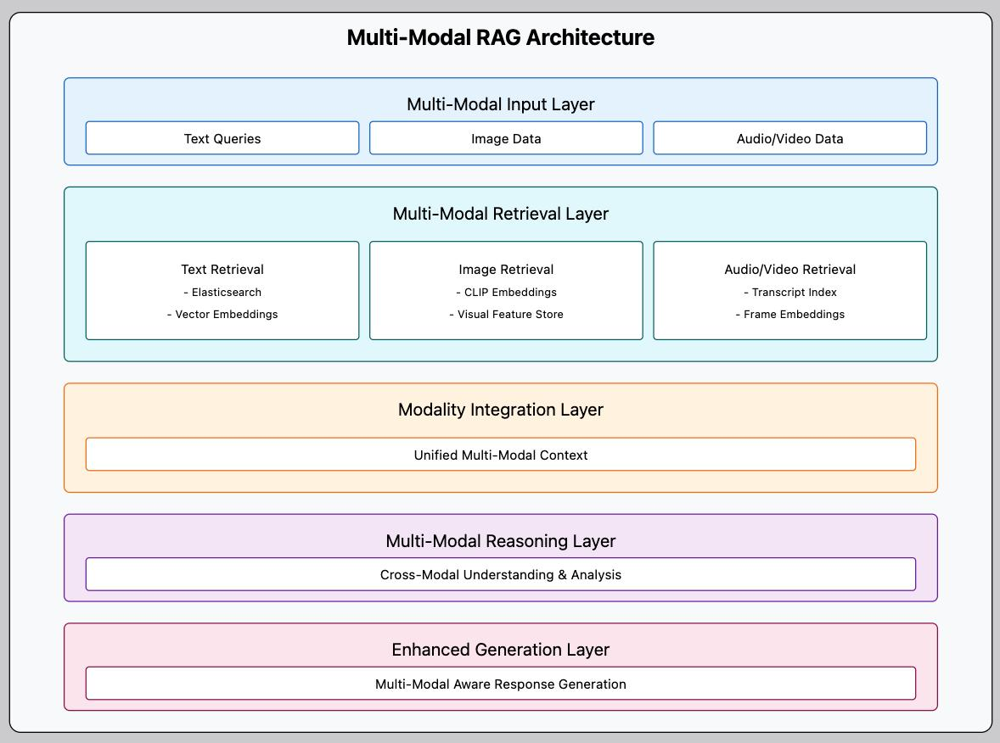

# Multi-Modal RAG Assistant

AI assistant for incident investigation. Upload screenshots, logs, PDFs, and test reports -- get root cause analysis, incident correlation, and AI-powered summaries.

## Features

- **Document Ingestion** -- PDF, PNG/JPG, TXT/LOG, JSON
- **OCR & Vision** -- Tesseract OCR + Ollama vision model
- **RAG Pipeline** -- Chunking, embedding, vector search, reranking
- **AI Agents** -- LangGraph multi-agent system (screenshot analysis, log analysis, incident correlation, root cause analysis)
- **Chat Interface** -- Streamlit UI with citations, confidence scores, dark mode
- **Observability** -- Structured logging, latency tracking

## Tech Stack

| Component | Technology |
|-----------|-----------|
| Backend | Python, FastAPI |
| Frontend | Streamlit |
| AI Framework | LangChain, LangGraph |
| LLM | Ollama (llama3.2, llama3.2-vision) |
| Vector DB | Qdrant |
| Embeddings | sentence-transformers (all-MiniLM-L6-v2) |
| Database | SQLite |
| Deployment | Docker, docker-compose |

**Total cost: $0** -- everything runs locally.

## Prerequisites

- Python 3.11+
- Docker & Docker Compose
- [Ollama](https://ollama.com) installed and running
- Tesseract OCR (`brew install tesseract` on macOS)

## Quick Start

### 1. Clone and setup

```bash
git clone <repo-url>
cd Multi-Modal-RAG-Assistant
cp .env.example .env
```

### 2. Pull Ollama models

```bash
ollama pull llama3.2
ollama pull llama3.2-vision
```

### 3. Start with Docker Compose

```bash
cd deployment
docker-compose up --build
```

This starts:
- **Backend** at http://localhost:8000
- **Qdrant** at http://localhost:6333
- **Frontend** at http://localhost:8501

### 4. Seed sample data (optional)

```bash
python deployment/scripts/seed_data.py
```

### Alternative: Run without Docker

```bash
# Install dependencies
pip install -r requirements.txt

# Start Qdrant (separate terminal)
docker run -p 6333:6333 -p 6334:6334 qdrant/qdrant:v1.13.0

# Start backend
uvicorn backend.main:app --reload --port 8000

# Start frontend (separate terminal)
streamlit run frontend/app.py
```

## API Endpoints

| Method | Endpoint | Description |
|--------|----------|-------------|
| GET | `/api/health` | Health check |
| POST | `/api/upload` | Upload a document |
| POST | `/api/query` | Query with RAG pipeline |
| POST | `/api/incidents/analyze` | Deep analysis with AI agents |
| GET | `/api/sources` | List uploaded documents |
| GET | `/api/sources/{doc_id}` | Get document details |

## Architecture



The system is organized into five layers:

1. **Multi-Modal Input Layer** -- Accepts text queries, image data (screenshots, PDFs), and audio/video data as input sources.
2. **Multi-Modal Retrieval Layer** -- Performs parallel retrieval across modalities: text retrieval via Qdrant vector embeddings, image retrieval via CLIP embeddings and visual feature store, and audio/video retrieval via transcript indexing and frame embeddings.
3. **Modality Integration Layer** -- Merges retrieval results from all modalities into a unified multi-modal context, ensuring the LLM has a complete picture.
4. **Multi-Modal Reasoning Layer** -- Applies cross-modal understanding and analysis through specialized AI agents (screenshot analyzer, log analyzer, incident correlator, root cause analyzer).
5. **Enhanced Generation Layer** -- Produces multi-modal aware responses with citations, confidence scores, and grounded recommendations.

```
Upload: File -> Validate -> Parse -> Chunk -> Embed -> Qdrant
Query:  Question -> Embed -> Search -> Rerank -> LLM -> Response
Agents: Query -> Router -> [Screenshot|Log|Incident] Agent -> RCA -> Report
```

## Project Structure

```
backend/          FastAPI application
frontend/         Streamlit UI
agents/           LangGraph multi-agent system
rag/              RAG pipeline (chunking, retrieval, reranking)
embeddings/       Embedding service
ingestion/        Document parsers
vectorstore/      Qdrant client
deployment/       Docker files
tests/            Tests and evaluation
data/             Sample data and uploads
```

## Running Tests

```bash
pip install -r requirements-dev.txt
pytest tests/ -v
```

## Configuration

All settings are in `.env`. Key options:

- `OLLAMA_MODEL` -- Text LLM model (default: llama3.2)
- `OLLAMA_VISION_MODEL` -- Vision model (default: llama3.2-vision)
- `CHUNK_SIZE` -- Document chunk size (default: 512)
- `RETRIEVAL_TOP_K` -- Number of candidates to retrieve (default: 10)
- `RERANK_TOP_K` -- Number of results after reranking (default: 5)
- `REQUIRE_API_KEY` -- Enable API key auth (default: false)
